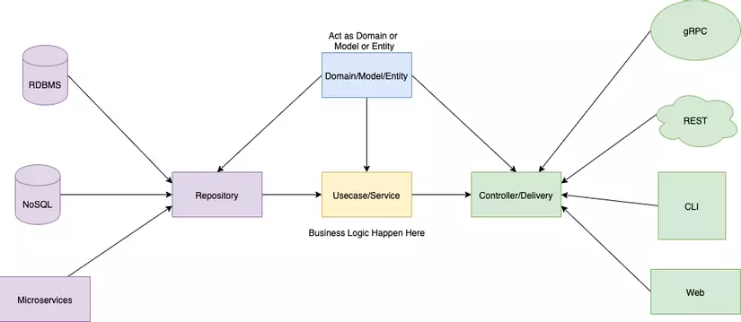
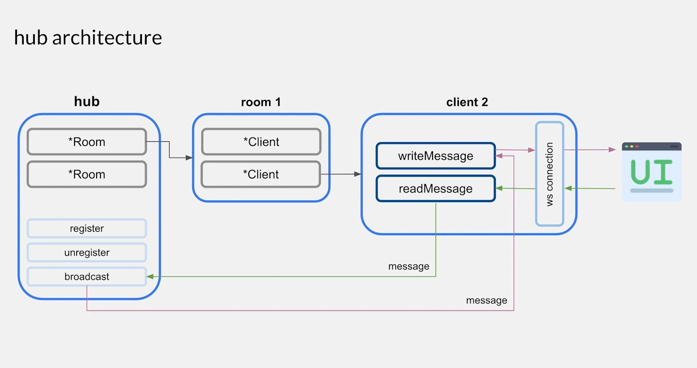

# <p style="text-align: center;">Go Realtime Chat App</p>

## Description
- A simple app in which users can create groups and chat within them.

## Architecture
- ### This project is build in Go, conforming **Clean Architecture**



- ### Chat feature using Websocket and **Hub Architecture**
    #### Using go routines and channels to handle rooms and messages




## Installation

```cpp
// TODO
```

## Known issues
- Room will be saved in main memory, deleted after reseting server.
- User can not see previous messages when joining the room.
- Messages will be lost when reloading browser.